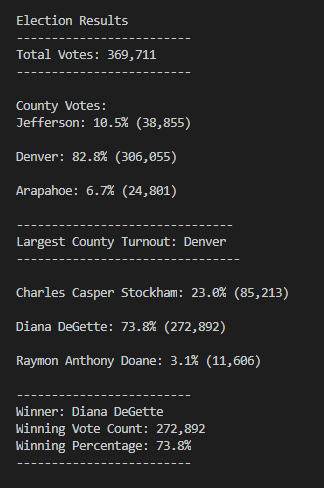

# Election-Analysis-Module
Using Python, Week 3

## Overview of Election Audit
This project's main objective was to complete the election audit of a recent local congressional election in the state of Colorado.

1. Calculate the total number of votes cast.
2. Get a complete list of counties that casted votes.
3. Determing the county with the largest turnout of voters.
4. Get a complete list of candidates who received votes.
5. Calculate the total number of votes each candidate received.
6. Calculate the percentage of votes each candidate won.
7. Determine the winner of the election based on popular vote.

## Election-Audit Results

**How many votes were cast in this congressional election?**

There were 369, 711 votes casted in this congressional election.

**Provide a breakdown of the number of votes and the percentage of total votes for each county in the precinct.**

According to the Election Results image displayed, the greatest number of votes came from the Denver county, making up 82.8% of the votes with 306,055 votes. Next was Jefferson county with 10.5% of the total votes and 38,855 votes. Lastly was Aparaphoe county only making up 6.7% of the votes with 24,801 votes. 

**Which county had the largest number of votes?**

The county with the largest number of votes was Denver.

**Provide a breakdown of the number of votes and the percentage of the total votes each candidate received.**

According to the Elections Results image, Diana DeGette had the most number of votes with 272,892 casted as well as 73.8% of the total vote. Next was Charles Casper Stockham with 23.0% of the vote and 85,213 votes casted. Last was Raymon Anthony Doane with 3.1% of the vote and 11,606 casted votes.
 
**Which candidate won the election, what was their vote count, and what was their percentage of the total votes?**

Diana DeGette won the election with 272,892 votes and 73.8% of the total votes casted.

## Election-Audit Summary

The script used in this congressional election can also be used on a larger scale with modifications to fit the needs of the individuals/organizations in need of providing both accurate and efficient information. For example, if this script was to be in use for a presidential election, one modification could be the inclusion of the political party of the candidates. Another example could be to include the different members of government who would be elected, including members of the House of Representatives, Senate and state government candidates.
